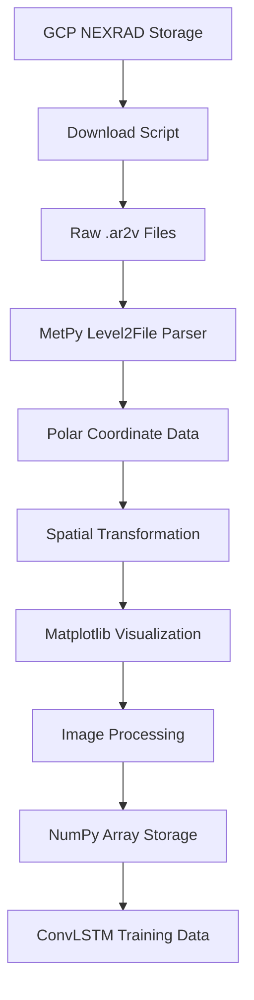

# Technical Processing Pipeline Documentation

## Processing Architecture Overview

This document details the technical implementation of converting raw NEXRAD Level-II radar data into training-ready arrays for ConvLSTM weather forecasting models.

## Data Flow Architecture



## Detailed Processing Steps

### 1. File Acquisition and Parsing

#### MetPy Level2File Integration
```python
# File format detection and parsing
with open(filepath, 'rb') as f:
    header = f.read(2)
    f.seek(0)
    
    if header == b'\x1f\x8b':  # Gzipped format
        level2_file = Level2File(filepath)
    else:  # Raw Archive Level-II format
        level2_file = Level2File(f)
```

#### Sweep Structure Analysis
- **Sweeps**: Multiple elevation angles (typically 9-14)
- **Rays per Sweep**: ~720 rays (0.5° azimuth resolution)
- **Data Products**: REF, VEL, SW, ZDR, PHI, RHO per ray
- **Range Gates**: Variable count depending on product

### 2. Reflectivity Data Extraction

#### Product Selection Logic
```python
# Verify reflectivity data availability
if b'REF' not in level2_file.sweeps[sweep][0][4]:
    return None  # Skip files without reflectivity

# Extract reflectivity header and data
ref_hdr = level2_file.sweeps[sweep][0][4][b'REF'][0]
ref_data = np.array([ray[4][b'REF'][1] for ray in level2_file.sweeps[sweep]])
```

#### Spatial Coordinate System
- **Azimuth**: 0-360° (0° = North, 90° = East)
- **Range**: 0-460km (varies by site and product)
- **Gate Width**: 250m for reflectivity
- **First Gate**: Typically 2.125km from radar

### 3. Coordinate Transformation

#### Polar to Cartesian Conversion
```python
# Extract coordinate arrays
az = np.array([ray[0].az_angle for ray in level2_file.sweeps[sweep]])
ref_range = np.arange(ref_hdr.num_gates) * ref_hdr.gate_width + ref_hdr.first_gate

# Convert to Cartesian coordinates
xlocs = ref_range * np.sin(np.deg2rad(az[:, np.newaxis]))
ylocs = ref_range * np.cos(np.deg2rad(az[:, np.newaxis]))
```

#### Coordinate System Details
- **Origin**: Radar location (0,0)
- **X-axis**: East-West (positive = East)
- **Y-axis**: North-South (positive = North)
- **Units**: Meters from radar site
- **Coverage**: ~300km radius effective range

### 4. Visualization Pipeline

#### Matplotlib Configuration
```python
# Configure for non-interactive processing
matplotlib.use('Agg')

# Create standardized plot
fig, axes = plt.subplots(1, 1, figsize=(6, 3))
axes.pcolormesh(xlocs, ylocs, reflectivity_data, cmap='viridis')
axes.set_aspect('equal', 'datalim')
axes.set_xlim(-150, 150)  # 150km East/West
axes.set_ylim(-150, 150)  # 150km North/South
axes.axis('off')  # Remove axis labels and ticks
```

#### Color Mapping Strategy
- **Colormap**: Viridis (perceptually uniform)
- **Value Range**: Automatic scaling based on data
- **Missing Data**: Handled as masked values
- **Dynamic Range**: Preserves intensity relationships

### 5. Image Processing Chain

#### Buffer Extraction
```python
# Render matplotlib figure to RGBA buffer
fig.canvas.draw()
buf = fig.canvas.buffer_rgba()
image_data = np.asarray(buf)

# Convert RGBA to RGB (remove alpha channel)
rgb_data = image_data[:, :, :3]
```

#### Spatial Cropping and Scaling
```python
# Crop to central region (focused coverage area)
height, width = rgb_data.shape[:2]
if height >= 180 and width >= 300:
    cropped_data = rgb_data[30:180, 150:300]  # 150x150 central region
else:
    cropped_data = rgb_data  # Use full image if too small

# Convert to grayscale
gray_data = cv2.cvtColor(cropped_data, cv2.COLOR_RGB2GRAY)

# Resize to standard dimensions
final_data = cv2.resize(gray_data, (100, 100), interpolation=cv2.INTER_AREA)
```

### 6. Quality Control and Validation

#### Data Validation Checks
```python
def validate_processed_data(data_array):
    checks = {
        'shape': data_array.shape == (100, 100),
        'dtype': data_array.dtype == np.uint8,
        'range': np.all((data_array >= 0) & (data_array <= 255)),
        'variance': np.var(data_array) > 0,  # Not all zeros
        'finite': np.all(np.isfinite(data_array))
    }
    return all(checks.values()), checks
```

#### Error Handling Strategy
- **Missing Files**: Skip and log
- **Corrupted Data**: Return None, continue processing
- **Empty Sweeps**: Skip file, no error
- **Processing Failures**: Log error, continue batch
- **Memory Issues**: Explicit cleanup after each file

## Storage and Organization

### NumPy Array Specifications

#### Array Structure
```python
# Final array characteristics
shape = (n_samples, 100, 100)  # 2D spatial grid per sample
dtype = np.uint8  # 8-bit integers (0-255)
memory_per_sample = 100 * 100 * 1 = 10,000 bytes = 10KB
```

#### File Naming Convention
```
{site_id}_data_{start_date}__{duration}days.npy
Examples:
- KATX_data_20240611_30days.npy
- PHWA_data_20240611_30days.npy
```

#### Metadata Preservation
```python
# Embedded in file structure or separate metadata files
metadata = {
    'site_id': 'KATX',
    'start_date': '2024-06-11',
    'end_date': '2024-07-10',
    'total_samples': 3000,
    'processing_date': '2024-08-02',
    'spatial_resolution': '100x100',
    'coverage_radius_km': 150,
    'data_product': 'REF',
    'coordinate_system': 'cartesian_centered'
}
```

## Performance Optimization

### Memory Management
```python
# Explicit cleanup to prevent memory leaks
fig.clf()
plt.close()
del image_data, rgb_data, gray_data
```

### Batch Processing Strategy
- **File-by-file**: Process individual radar scans
- **Day-by-day**: Accumulate daily arrays
- **Site-by-site**: Complete site processing before moving to next
- **Parallel sites**: Multiple sites processed simultaneously

### Storage Efficiency
```python
# Compress arrays during storage
np.savez_compressed('compressed_data.npz', 
                   data=final_array, 
                   metadata=metadata_dict)
```

## Integration with Deep Learning Pipeline

### TensorFlow/Keras Compatibility
```python
# Direct loading for model training
def load_site_data(filepath):
    data = np.load(filepath)
    # Normalize to [0, 1] range
    normalized = data.astype(np.float32) / 255.0
    return normalized

# Shape for ConvLSTM input
# (batch_size, timesteps, height, width, channels)
model_input_shape = (None, 10, 100, 100, 1)
```

### Temporal Sequence Generation
```python
def create_sequences(data_array, sequence_length=10, forecast_horizon=1):
    """Create input/output sequences for ConvLSTM training"""
    sequences = []
    targets = []
    
    for i in range(len(data_array) - sequence_length - forecast_horizon + 1):
        seq = data_array[i:i+sequence_length]
        target = data_array[i+sequence_length:i+sequence_length+forecast_horizon]
        sequences.append(seq)
        targets.append(target)
    
    return np.array(sequences), np.array(targets)
```

## Monitoring and Logging

### Processing Statistics
```python
# Track processing metrics
stats = {
    'files_processed': 0,
    'files_failed': 0,
    'processing_time_total': 0,
    'average_file_size_mb': 0,
    'samples_generated': 0,
    'errors_by_type': {}
}
```

### Quality Metrics
- **Success Rate**: Percentage of files successfully processed
- **Processing Speed**: Files per minute
- **Data Quality**: Distribution of pixel values
- **Temporal Coverage**: Gaps in time series
- **Spatial Consistency**: Coordinate transformation accuracy

## Error Recovery and Robustness

### Common Failure Modes
1. **Corrupted Files**: Invalid headers or incomplete downloads
2. **Missing Products**: REF data not available in sweep
3. **Empty Sweeps**: No radar data for time period
4. **Memory Limitations**: Large files exceed available RAM
5. **Coordinate Issues**: Invalid azimuth/range values

### Recovery Strategies
```python
def robust_file_processing(filepath):
    try:
        return process_nexrad_file(filepath)
    except MemoryError:
        # Clear memory and retry with reduced processing
        gc.collect()
        return process_nexrad_file_minimal(filepath)
    except (IOError, ValueError) as e:
        # Log error and skip file
        logger.warning(f"Skipping corrupted file {filepath}: {e}")
        return None
    except Exception as e:
        # Unexpected error - log and continue
        logger.error(f"Unexpected error processing {filepath}: {e}")
        return None
```

---

**Document Version**: 1.0  
**Last Updated**: August 2024  
**Technical Review**: Pending  
**Dependencies**: MetPy 1.3+, OpenCV 4.5+, Matplotlib 3.5+